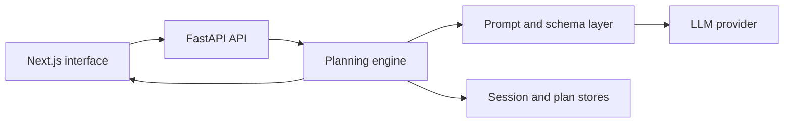

# Goal AI

An AI planning prototype that turns a broad goal into measurable workstreams, dependency-aware steps, and progress updates through a FastAPI API and Next.js interface.

## What it demonstrates

- Structured LLM outputs validated with Pydantic models
- Goal decomposition into explicit workstreams and graph relationships
- Provider boundaries that allow deterministic test doubles
- A typed FastAPI and Next.js workflow in a small monorepo

## Architecture



The FastAPI sidecar exposes typed graph and planning endpoints. The planning engine applies
goal decomposition, baseline answers, dependency ordering, plan generation, and progress
updates to Pydantic graph models. The API saves graph state and UI session state while the
Next.js interface renders and updates the staged workflow.

## Planning flow

1. Create a goal graph through the API or interface.
2. Decompose the goal into workstreams with ordered sibling dependencies.
3. Collect baseline answers to refine the SMART fields, assumptions, constraints, and unknowns.
4. Generate a chronological task plan for a selected workstream and toggle task progress as work
   is completed.

The production provider requests structured responses and validates them against Pydantic
schemas. Tests can use the deterministic `MockProvider` at the same provider boundary.

## Local development

Create a virtual environment, install the Python and JavaScript dependencies, and configure an
OpenAI key for live model calls:

```bash
python -m venv .venv
source .venv/bin/activate
python -m pip install -e '.[dev]'
pnpm install
export OPENAI_API_KEY=your-token
```

You can instead place `OPENAI_API_KEY=...` in the repository-root `.env` or `.env.local`. The
FastAPI sidecar loads those files on startup without replacing an exported shell value.

Start the API and web app together from the repository root:

```bash
pnpm dev
```

This serves FastAPI at `http://127.0.0.1:8001` and Next.js at `http://127.0.0.1:3000`.
Set `NEXT_PUBLIC_SMARTGOT_API` when the web app should use a different API origin.

## Validation

Run the full local verification suite from the repository root:

```bash
python -m pytest -q
pnpm lint
pnpm typecheck
pnpm build
```

The test suite uses deterministic provider doubles, so these checks do not require an OpenAI
API key.

## Repository structure

```text
apps/
  api/              FastAPI sidecar, typed endpoint models, jobs, and session storage
  web/              Next.js interface and graph workflow components
src/smart_got/      Planning engine, Pydantic models, prompts, providers, and graph storage
tests/              Engine, model, provider, prompt, and API tests
```

## Current limitations

An OpenAI API key is required for live model calls; generation endpoints return a clear API
error when it is unavailable. This repository is a research prototype rather than a production
task-management service.
